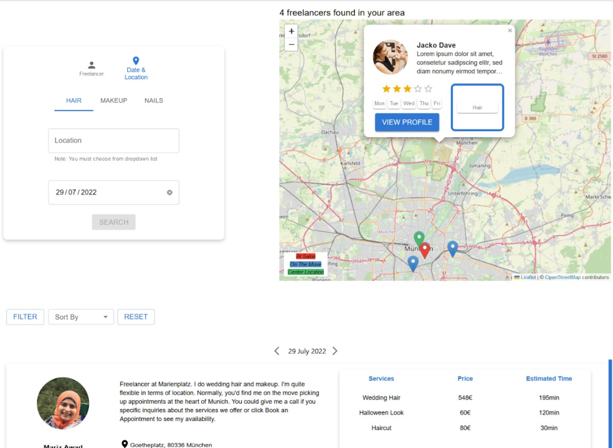
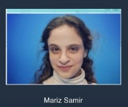
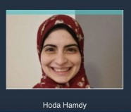

# GloWish: Where Beauty Artists Shine and Clients Find the Perfect Match
> GloWish is a dual-impact freelancing platform that connects up-and-coming beauty artists with clients, offering an automated booking system that makes appointments effortless while helping professionals elevate their careers.

This project aims to create a dynamic beauty hub that connects freelance makeup artists and hairdressers—especially those new to the industry—with customers seeking beauty services. The platform will not only help emerging professionals showcase their talents and attract clients but also assist customers in finding the most suitable artist for their needs. By bridging the gap between beauty seekers and beauty makers, this initiative will streamline appointment booking, build trust, and foster a thriving freelance beauty community.

The project was divided into 4 use cases:
1. [Updating Freelancer Profile and Appointment Availability](use_case1.md#use-case-1-updating-freelancer-profile-and-appointment-availability)
2. [Searching and Filtering Freelancer Service](use_case2.md#use-case-2-searching-and-filtering-freelancer-service)
3. [Booking an Appointment and Paying](use_case3.md#use-case-3-booking-an-appointment-and-paying)
4. [Customer Managing Appointments](use_case4.md#use-case-4-customer-managing-appointments)

## Meet the Developers
| Maria Nakhla | Mariz Awad | Hoda Hamdy |
|---------|---------|---------|
|  |  |  | 
| [linkedin.com/in/marianakhla](https://www.linkedin.com/in/marianakhla/)  | [linkedin.com/in/mariz-awad-m-sc-4354a1120/](https://www.linkedin.com/in/mariz-awad-m-sc-4354a1120/) | [linkedin.com/in/hoda-hisham/](https://www.linkedin.com/in/hoda-hisham/) |

