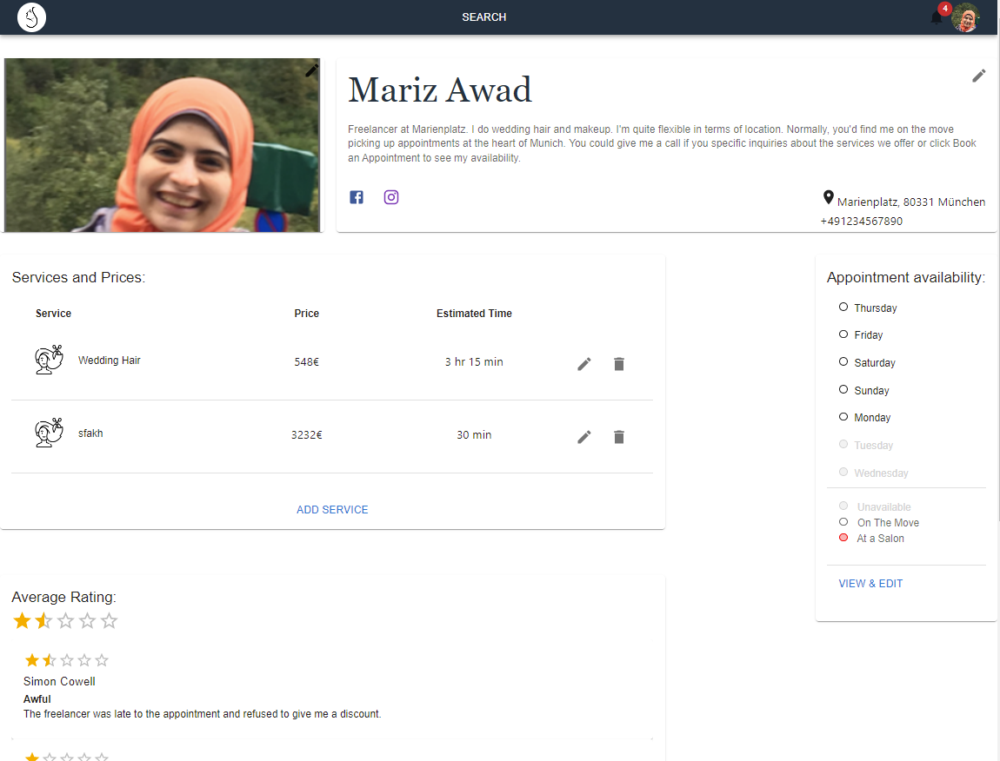

## Use Case 1: Updating Freelancer Profile and Appointment Availability

Freelancers—whether makeup artists or hairdressers—enjoy a dedicated Profile page where they can:

- Add a profile picture, update, or delete it
- Edit their bio
- Add links to their Facebook and Instagram accounts
- Specify the location where they are based
- Add, edit, or delete a service they offer, including price and estimated service time
- View their customer reviews and ratings
- Add and delete pictures from their portfolio.
  
In addition, freelancers can manage their availability for the upcoming three months with a unique feature that allows them to specify their daily status as either “on the move” or “at a salon.” This dual-mode option offers exceptional flexibility:

``On the move:`` Indicates that the freelancer is available to travel to customers’ locations within a defined radius, providing a personalized service experience.

``At a salon:`` Indicates that the freelancer operates from a fixed location, offering the stability and consistency of a traditional salon setup.

| 1 | 2 | 3 |
|---------|---------|---------|
|  |  |  |

The availability management process unfolds in three steps:

1. **Setting the Default:**
The freelancer sets standard working parameters for a typical day. If working “at a salon,” they input the default salon location; if “on the move,” they enter a default area center and radius. They also define default working hours, lunch break times, and weekly off days.

1. **Choosing a Specific Date to Edit:**
A calendar view—powered by Material-UI’s CalendarPicker—allows freelancers to select a specific date. Each day is clearly marked as “At a Salon,” “On the Move,” or “Off Day,” and the calendar indicates whether the day has pre-scheduled appointments.

1. **Editing a Specific Date:**
Once a date is selected, freelancers can adjust the location and working hours for that day, or revert to default settings. Importantly, if appointments have already been scheduled, the system prevents changes that would conflict with existing bookings.

### Technical Implementation Details:

This feature is built on the MERN stack and incorporates several modern libraries and APIs to ensure a seamless, robust user experience:

*Custom Form Management:*
A custom React hook, [`useForm`](https://react-hook-form.com/docs/useform), is used to manage form data entry, enforce input constraints, and handle error states effectively.

*Data Validation:*
Regular expressions validate the formats of emails, Facebook URLs, and phone numbers, ensuring consistent and reliable data input.

*Location Services:*
The [`PTV API`](https://developer.myptv.com/en) is integrated to provide an intuitive location autocomplete feature, as well as geocoding functionality to retrieve longitude and latitude coordinates for the selected addresses.

*Calendar and Date Handling:*
The Material-UI [`CalendarPicker`](https://mui.com/x/react-date-pickers/?srsltid=AfmBOooUY6hbTP85xiu_Mw9Y9-RylnmOpqKhVLVZPulLu2m88B7Zoqgw) component facilitates smooth date selection on the frontend, while the [`date-fns`](https://date-fns.org/) library is used on the backend to manipulate and format dates accurately.

*Media Storage:*
[`Firebase`](https://firebase.google.com/) is employed for uploading and storing profile and portfolio images, offering scalable and reliable media management.

