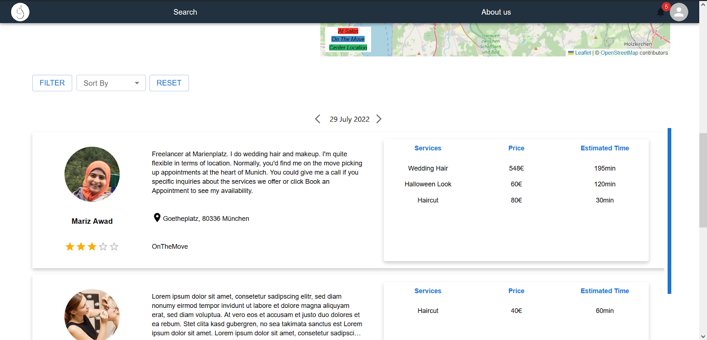

## Use Case 2: Searching and Filtering Freelancer Service

Clients seeking beauty services in Hair, Makeup, or Nails can easily locate the perfect freelancer through two main search options:

**Searching by Name:**
Clients can input a freelancer’s name, and the platform will render profiles that match the search criteria.

**Searching by Date and Location:**
Clients enter a desired date and venue location, and the system returns all available freelancers who are either:
- `On the Move:` Ready to travel within a defined radius around the client’s location.
- `At a Salon:` Operating from a fixed location nearby.

Additionally, clients can interact with an embedded map to visually navigate and choose freelancers that best suit their geographical preferences. 

A scrollable list displays key freelancer details—including ratings, location, bio, and services offered—with navigation features such as left/right arrows for date adjustments. Filtering options allow clients to refine the list by status (On the Move or At a Salon), price range, and rating, while sorting options enable arrangement by starting price or average rating. Finally, the client clicks on the specific freelancer they chose to view their profile and book an appointment.

## Technical Implementation Details:

*Interactive Mapping:* The integration of the [`React Leaflet`](https://react-leaflet.js.org/) component embeds a dynamic map that allows users to navigate and visually filter freelancers based on location and availability. This component synchronizes with user-defined search criteria—specifically date, services and location—to display relevant results.