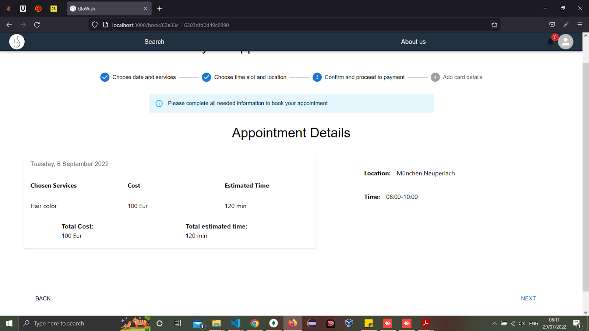

## Use Case 3: Booking an Appointment and Paying

The appointment booking journey begins on a freelancer’s profile when a customer clicks the “book an appointment” button, triggering a multi-step process:

1. **Selecting Date and Services:** 

A calendar is rendered showing the freelancer’s availability (e.g., “On the move,” “At a Salon,” or “Fully Booked/Off”).
The freelancer’s services are displayed, complete with pricing and estimated durations.
Customers select the desired services, enabling the “Next” button once their choices are confirmed.

2. **Choosing Time Slot and Location:**

A summary of the chosen appointment date and services is displayed.
Customers select a specific time slot for the appointment.
An interactive map shows the freelancer’s location and service radius for the selected date and prompts the customer to choose the location. If the freelancer was on-the-move,  
the customer must input an appointment location within the specified radius. If the freelancer was at-the-salon, the map displays a fixed salon location that cannot be edited.
Customers have the option to return to the previous step to make changes or continue forward.
3. **Reviewing Appointment Details:**

A detailed summary is presented, including the appointment date, selected services, time slot, and location information.
By clicking Next, customers confirm the appointment and proceed to payment.
4. **Processing Payment:**

Customers are redirected to the Stripe payment gateway, where they enter their card details and click “Pay and Confirm Appointment”. A confirmation message is displayed upon successful payment; otherwise, an error alert notifies the customer of any issues with the transaction.

## Technical Implementation Details:
*Payment Integration with Stripe:*
Payment processing is handled by the [`Stripe`](https://stripe.com/de) API, ensuring secure entry and verification of card details, as well as reliable transaction processing.
