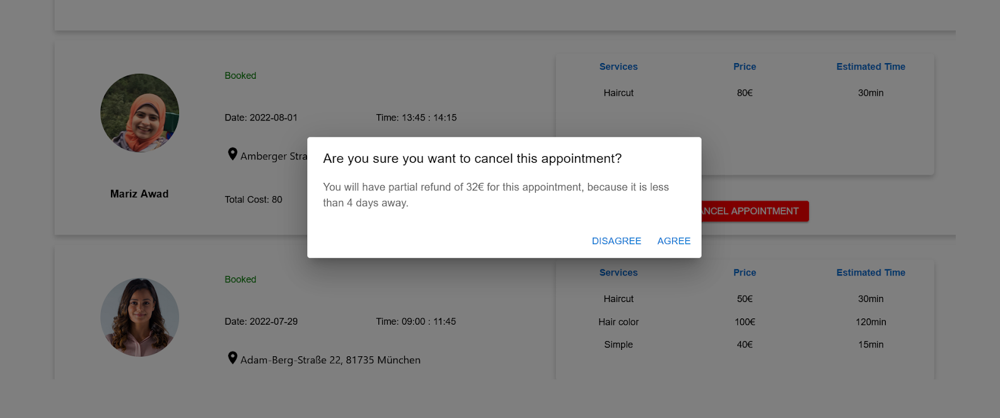

## Use Case 4: Customer Managing Appointments

Customers can access the "My Appointments" page by clicking their profile picture. On this page, they can view a comprehensive list of their appointments, categorized into active, past, and upcoming. Each appointment is displayed as a card featuring key summary details. For upcoming appointments, customers have the option to cancel within the allowed cancellation notice period to receive a full refund of their deposit. In cases of late cancellation, a partial refund may be issued, and both the freelancer and customer receive a notification regarding the cancellation.

## Technical Implementation Details:
*Real-Time Notifications System:* [`Socket.IO`](https://socket.io/docs/v4/) is integrated to facilitate push notifications via WebSocket technology, allowing users to receive immediate alerts for events such as registration, profile updates, or appointment confirmations. For users who are offline, notifications are stored in the database with a corresponding read status, ensuring that all missed messages are readily accessible upon the next login. This robust implementation guarantees that both customers and freelancers stay informed and connected throughout their interaction with the platform.